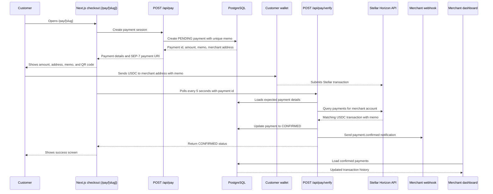

# StellarPay Architecture

This document shows how StellarPay detects a USDC payment from checkout through merchant confirmation.

## Payment Flow



## System Overview

```mermaid
graph TD
    Customer[Customer browser] --> Checkout[Next.js checkout page]
    Merchant[Merchant dashboard] --> Dashboard[Next.js dashboard routes]
    Checkout --> PayAPI[/api/pay]
    Checkout --> VerifyAPI[/api/pay/verify]
    Dashboard --> MerchantAPI[/api/merchants and /api/payments]
    PayAPI --> Database[(PostgreSQL via Prisma)]
    VerifyAPI --> Database
    MerchantAPI --> Database
    VerifyAPI --> Horizon[Stellar Horizon API]
    MerchantAPI --> Horizon
    PayAPI --> SEP7[SEP-7 payment URI builder]
    VerifyAPI --> Webhook[Merchant webhook endpoint]
```

## Runtime Responsibilities

- The checkout page creates a pending payment when a customer starts checkout.
- The payment API stores the amount, merchant Stellar address, and unique memo.
- The customer wallet sends USDC directly to the merchant Stellar address.
- The verification API checks Horizon for a matching payment operation and memo.
- The database stores payment state transitions from `PENDING` to `CONFIRMED`.
- The webhook utility notifies the merchant backend after confirmation.
- The dashboard reads confirmed payments from PostgreSQL for merchant reporting.

## Glossary

- **Memo**: A short Stellar transaction field used as the payment reference. StellarPay creates a unique memo such as `SP-a1b2c3d4` so a received USDC transfer can be matched to one checkout session.
- **Horizon**: Stellar's HTTP API for reading accounts, operations, payments, and transactions. StellarPay uses Horizon to find incoming payments and verify transaction hashes.
- **SEP-7**: A Stellar URI format for wallet deep links. StellarPay builds `web+stellar:pay?...` links so wallets can pre-fill the destination, asset, amount, and memo.
- **Friendbot**: A Stellar testnet faucet that funds new testnet accounts with XLM. It is useful for local development and testnet demos only.
- **USDC asset**: An issued Stellar asset identified by code `USDC` and an issuer public key. StellarPay accepts the configured USDC issuer for the active network.
- **Pending payment**: A database record created before funds are detected on Stellar.
- **Confirmed payment**: A payment record that has a matching on-chain USDC transfer with the expected amount and memo.
